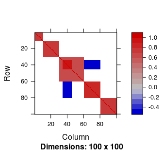
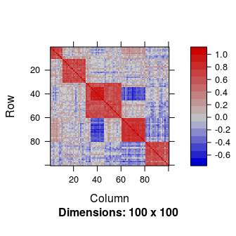
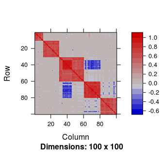
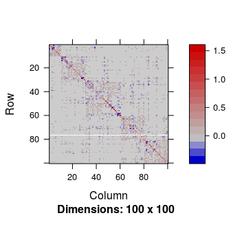
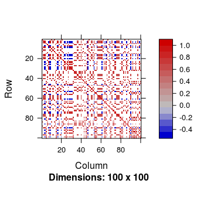
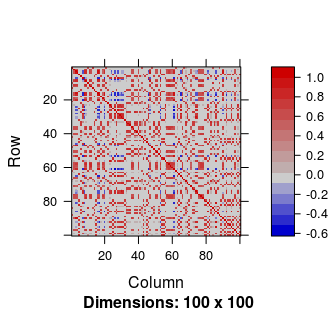
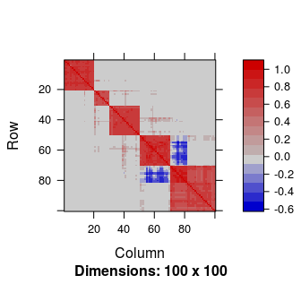
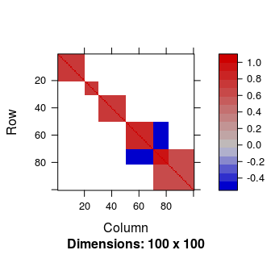
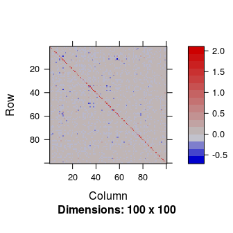

Introduction
============

This package implements the algorithm proposed by Perrot-Dockès and Lévy-Leduc in \[1\]. For further details we refer the reader to this paper. We shall consider the following framework. Let **E**<sub>1</sub>, **E**<sub>2</sub>, ⋯, **E**<sub>*n*</sub>, *n* zero-mean i.i.d. *q*-dimensional random vectors having a covariance matrix **Σ** such that the number *q* of its rows and columns is much larger than *n*. The goal of the package is to propose a new estimator of **Σ** and of the square root of its inverse, in the particular case where **Σ** is assumed to have a block structure without limiting ourselves to diagonal blocks. More precisely, in this paper, we shall assume that
\begin{equation}\label{eq:Sigma}
\boldsymbol{\Sigma}=\boldsymbol{Z}\boldsymbol{Z}'+\boldsymbol{D},
\end{equation}
where **Z** is a *q* × *k* sparse matrix with *k* ≪ *q*, **Z**′ denotes the transpose of the matrix **Z** and **D** is a diagonal matrix such that the diagonal terms of **Σ** are equal to one.

Our approach consists in providing a low rank matrix approximation of the **Z****Z**′ part of **Σ** and then in using a ℓ<sub>1</sub> regularization in order to obtain a sparse estimator of **Σ**. More precisely, since **Σ** is a correlation matrix, it is a symmetric matrix with ones on its diagonal, thus all the information is contained in its upper triangular part without its diagonal. If we know **P** the (*q* − 1)×(*q* − 1) symmetric matrix, which has for upper triangular part the upper triangular part of **Σ** without its diagonal, we know **Σ**. The matrix **P** has the advantage to have a low rank. In the following, we propose to first estimate the block matrix **P**.

We shall moreover propose a methodology to estimate **Σ** in the case where the block structure is latent that is when the columns and rows of **Σ** have to be permuted according to an unknown permutation in order to make the block structure appear. In this case, a hierarchical clustering step has to be applied beforehand.

Simulation of **Σ** having a block structure
============================================

In order to generate a matrix **Σ** having a block structure with extra-diagonal blocks and *q* = 100, we can use the function as follows:

``` r
q <- 100
Sigma <- Simu_Sigma(q = q, diag = FALSE, equal = TRUE)
```

The matrix **Σ** is displayed in Figure .



Using the matrix **Σ** generated by the function a *n* × *q* matrix **E** was generated such that its rows are independent zero-mean Gaussian random vectors having a covariance matrix equal to **Σ** and *n* = 30.

``` r
n <- 30
E <- matrix(rnorm(n * q), ncol = q) %*% chol(as.matrix(Sigma))
```

Estimation of **Σ** and **Σ**<sup>−1/2</sup>
============================================

In order to get an estimation of **Σ** the function was applied. Since the data set was simulated, the rank of **P**, the sub-matrix of **Σ**, and its number of non null values are known.

``` r
k <- 5
nb_nn0 <- sum(Sigma[upper.tri(Sigma, diag = FALSE)] != 0)
res_known <-  Sigma_estimation(E, k = k, nb_nn0 = nb_nn0)
```

Our estimator $\\widehat{\\boldsymbol{\\Sigma}}$ of **Σ** is given by . It is displayed in Figure and is obtained by using:

``` r
Matrix::image(res_known$Sigma_est)
```


The Frobenius norm $\\|\\boldsymbol{\\Sigma}-\\widehat{\\boldsymbol{\\Sigma}}\\|$ is equal to 5.5.

For comparison purpose, the sample correlation matrix is displayed in Figure .

``` r
Matrix::image(Matrix::Matrix(cor(E)))
```



The Frobenius norm $\\|\\boldsymbol{\\Sigma}-\\widehat{\\boldsymbol{\\Sigma}}\_{\\textrm{emp}}\\|$ is equal to 14.5, where $\\widehat{\\boldsymbol{\\Sigma}}\_{\\textrm{emp}}$ denotes the sample correlation matrix.

In practice, the number of non null values and the rank of of **P** are unknown. These parameters can be both estimated using the function as follows:

``` r
res <- Sigma_estimation(E, kmax = 90, prop.max = 0.6, step = 100)
```

The rank is by default chosen between 1 and min(*q* − 1, 100), this value can be changed using the argument , which is here equal to 90. The number of non null values is chosen between *q* and 70% of the number of entries in the upper triangular part of **Σ**, namely *q*(*q* − 1)/2. The step between two consecutive values of this sequence can be changed using the argument $\\verb|step|$ and the proportion 70% can be changed using the $\\verb|prop.max|$ argument. This sequence can also be given using the argument. Here, this sequence is between *q* and 60% of the number of entries in the upper triangular part of **Σ** with a step of 100. The corresponding estimator of **Σ** is displayed in Figure .

``` r
Matrix::image(res$Sigma_est)
```



We can see from this figure that the estimation of **Σ** does not seem to be altered by having to estimate the number of non null values and the rank of the matrix. The Frobenius norm $\\|\\boldsymbol{\\Sigma}-\\widehat{\\boldsymbol{\\Sigma}}\\|$ is equal to 5.5.

The estimated rank and the estimated number of non null values can be obtained by and , respectively. They are here equal to 5 and 1300, respectively. Note that the true values of these parameters are 5 and 1270.

An estimator of **Σ**<sup>−1/2</sup> is obtained thanks to . It can be used to remove the dependence that may exist between the columns of **E**. To achieve this goal $\\widehat{\\boldsymbol{\\Sigma}}^{-1/2}\\boldsymbol{\\Sigma}\\widehat{\\boldsymbol{\\Sigma}}^{-1/2}$, which is displayed in Figure , should be close to the identity matrix:

``` r
Matrix::image(res$S_inv_12 %*% Sigma %*% res$S_inv_12)
```



The associated Frobenius norm $||\\widehat{\\boldsymbol{\\Sigma}}^{-1/2}\\boldsymbol{\\Sigma}\\widehat{\\boldsymbol{\\Sigma}}^{-1/2}-\\textrm{Id}\_q||=$ 6.5.

Estimation of **Σ** and **Σ**<sup>−1/2</sup> when the block structure is latent
===============================================================================

In practice, it is possible that the block structure of **Σ** only appears after having permuted its rows and columns according to a well chosen permutation. We explain hereafter how to estimate **Σ** and **Σ**<sup>−1/2</sup> in this case. We first generate such a matrix by applying a random permutation to the rows and columns of the matrix **Σ** previously generated.

``` r
samp <- sample(1:q, q, replace = FALSE)
Sigma_samp <- Sigma[samp, samp]
```

The corresponding matrix is displayed in Figure .

``` r
Matrix::image(Sigma_samp)
```



In such a situation where the columns and rows have to be permuted according to an unknown permutation, we propose to use a hierarchical clustering as the first step of our methodology and then use the same strategy. This is performed by putting in the arguments of the function .

``` r
E <- matrix(rnorm(n * q), ncol = q) %*% chol(as.matrix(Sigma_samp))
res_samp <- Sigma_estimation(E, prop.max = 0.6, step = 100, reorder = TRUE)
```

The estimated matrix is displayed in Figure .

``` r
Matrix::image(res_samp$Sigma_est)
```



The permutation to make the block structure appear is available from . The corresponding estimated correlation matrix in which the columns have been permuted in order to make the block structure appear is obtained using the following lines and is displayed in Figure :

``` r
ord <- res_samp$order
Matrix::image(res_samp$Sigma_est[ord, ord])
```



This matrix has to be compared with the following one displayed in Figure :

``` r
Matrix::image(Sigma_samp[ord, ord])
```



Once again, our strategy does not seem to be altered by the permutation of the columns of the original matrix **Σ**. The Frobenius norm of the error is equal to 6.9.

In this situation $\\widehat{\\boldsymbol{\\Sigma}}^{-1/2}$ is still available. The matrix $\\widehat{\\boldsymbol{\\Sigma}}^{-1/2}\\boldsymbol{\\Sigma}\\widehat{\\boldsymbol{\\Sigma}}^{-1/2}$, which is displayed in Figure , should be close to the identity matrix:

``` r
Matrix::image(res_samp$S_inv_12 %*% Sigma_samp %*%res_samp$S_inv_12)
```



The associated Frobenius norm $||\\widehat{\\boldsymbol{\\Sigma}}^{-1/2}\\boldsymbol{\\Sigma}\\widehat{\\boldsymbol{\\Sigma}}^{-1/2}-\\textrm{Id}\_q||=$ 6.

All the values of the Frobenius norms are quite close meaning that our methodology is efficient even when the parameters are unknown and when the columns and rows have to be permuted in order to make the block structure appear.

References
==========

\[1\] M. Perrot-Dockès and C. Lévy-Leduc. "Estimation of large block covariance matrices: Application to the analysis of gene expression data", arXiv:1806.10093.
